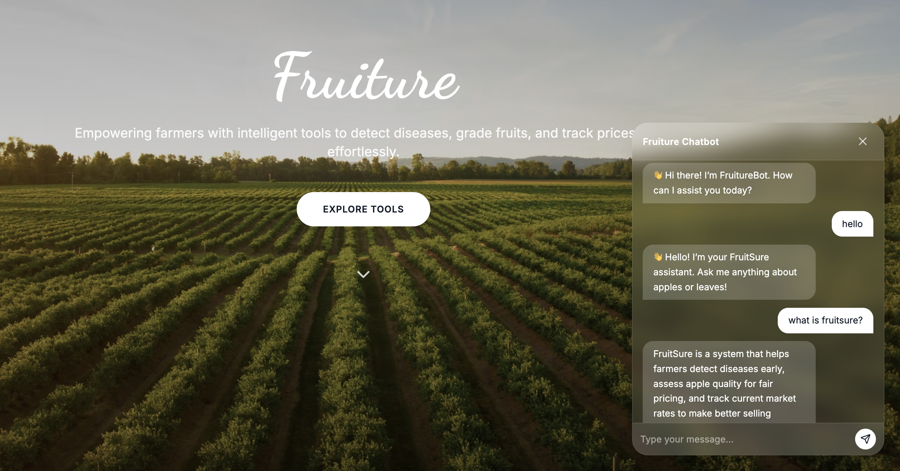
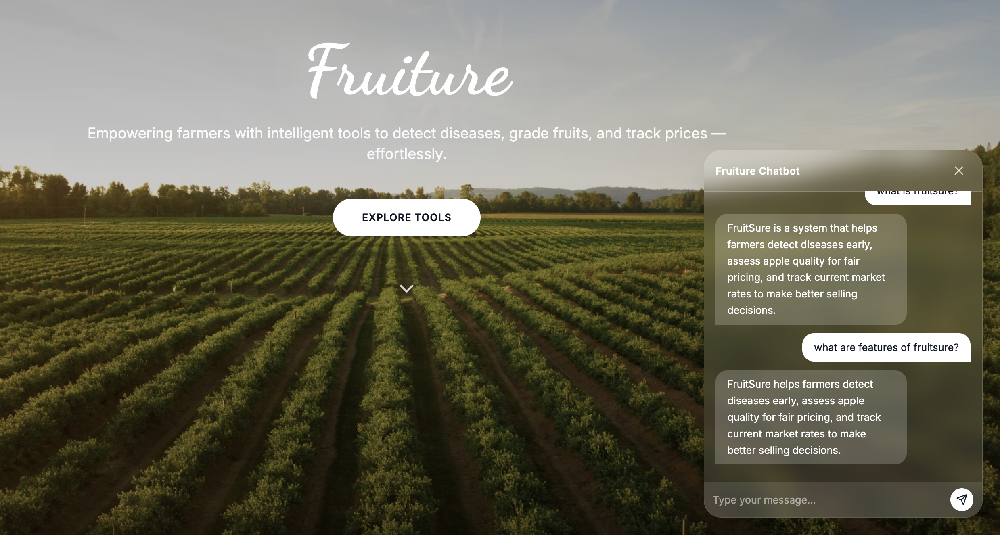
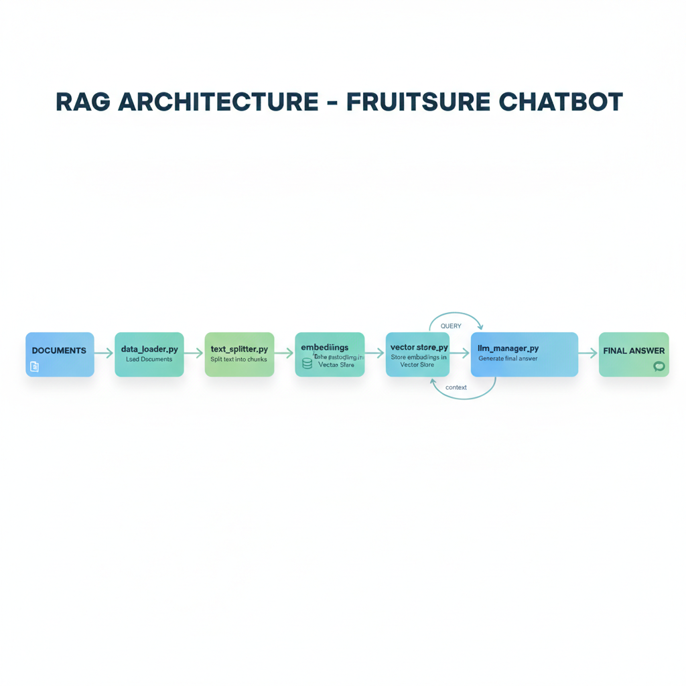

# 🌱 FruitSure AI – RAG-Based Chatbot for Farmers

FruitSure is an **AI-powered agricultural intelligence system** focused on improving fruit quality, disease detection, grading, and post-harvest handling.  
As part of this platform, we built an advanced **RAG (Retrieval-Augmented Generation) Chatbot** designed to provide farmers and agri-stakeholders with **accurate, research-backed answers** in simple natural language.

This chatbot allows users to ask questions about fruit diseases, storage methods, quality standards, symptoms, and best practices—making FruitSure a reliable **AI companion for farmers, FPOs, packers, exporters, and inspectors.**

---

# 📸 Demo Screenshots

<div style="display: flex; gap: 10px;">

  
  

</div>

---

# 🧠 RAG Architecture Overview

The chatbot is powered by a modular and scalable **Retrieval-Augmented Generation pipeline**.



### **How it Works**
1. **Load Documents** using `data_loader.py`  
2. **Split Text** into clean chunks using `text_splitter.py`  
3. **Generate Embeddings** using `embeddings_manager.py`  
4. **Store & Retrieve** vectors via `vector_store.py` and `retriever.py`  
5. **LLM Answering** handled by `llm_manager.py`  
6. **Final RAG Flow** orchestrated in `rag_pipeline_final.py`

This ensures responses are grounded in real FruitSure data—not hallucinated.

---

# 🚀 Getting Started

## 1️⃣ Install Dependencies
```bash
pip install -r requirements.txt
